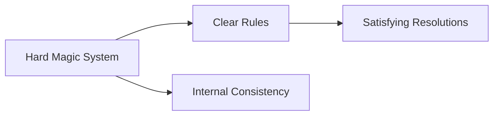

---
{"dg-publish":true,"permalink":"/notes/mermaid-js/","dg-note-properties":{}}
---

- Link: [[Notes/Diagrams-as-Code (DaC)\|Diagrams-as-Code (DaC)]] 

Mermaid.js is a JavaScript-based tool that uses a Markdown-like text syntax to automatically render professional diagrams and charts. By adopting a "Diagrams as Code" approach, it eliminates the need for manual drawing tools, allowing you to create, edit, and version-control complex visuals directly within your documentation or code repository. This makes it an essential tool for teams who want to maintain up-to-date system architectures, workflows, and timelines without the friction of constantly exporting and re-uploading static image files.

# Tools
* Mermaid.js works in Obsidian

# Mermaid.js Examples
## Example 1

Last Updated: 11/06/26